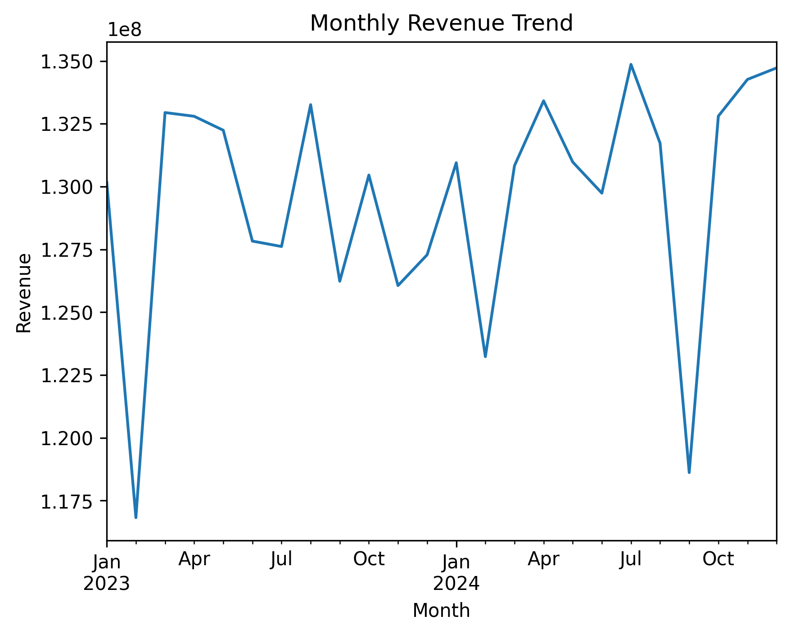
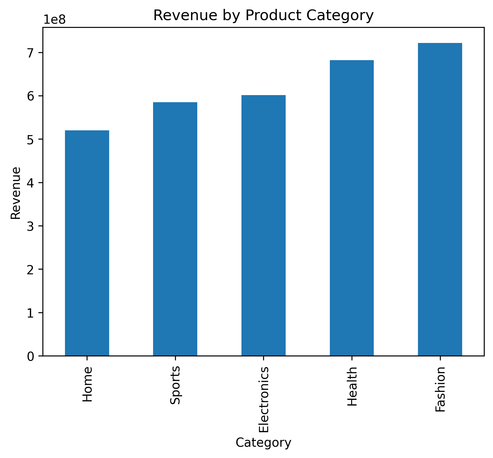
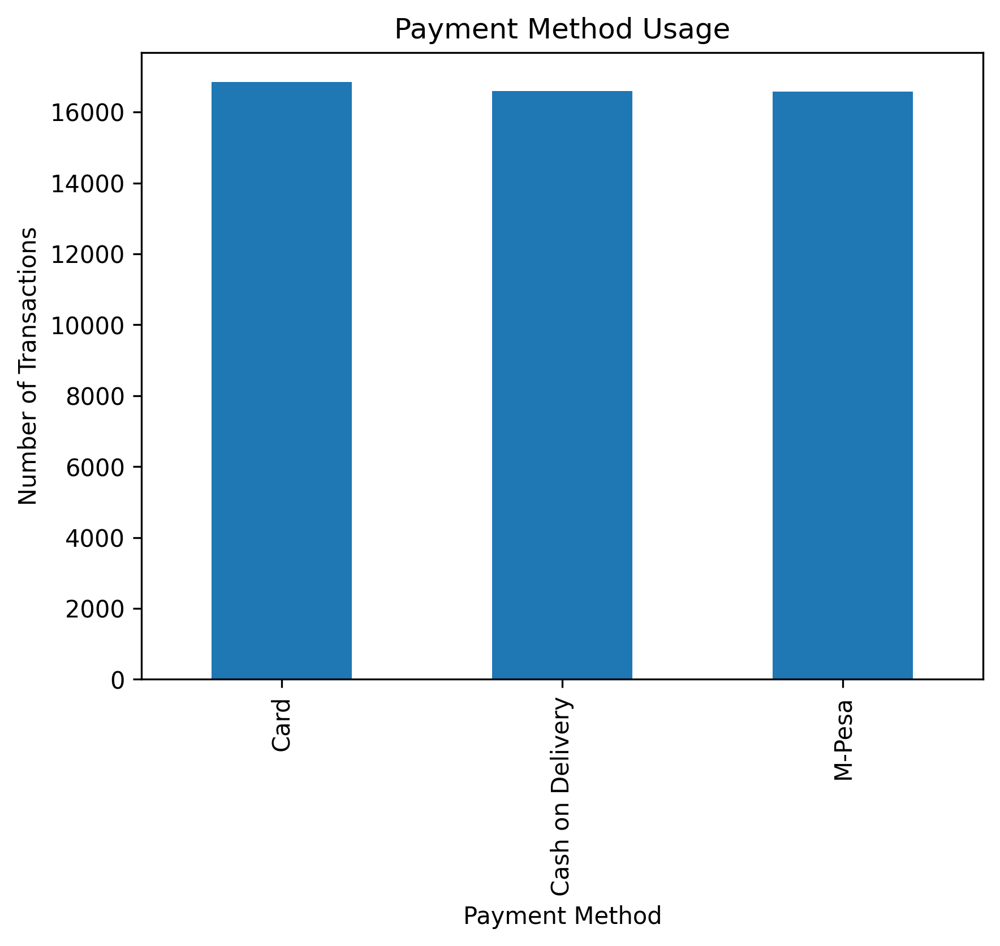

# E-Commerce Customer Analytics

A data analytics project exploring customer behaviour, revenue trends, RFM segmentation, and payment activity in an e-commerce environment.

## Key Visualizations

### Monthly Revenue Trend
<p align="center">

</p>

### Revenue by Product Category
<p align="center">

</p>

### Payment Method Usage
<p align="center">

</p>

## Project Overview
This project analyzes 50,000 e-commerce orders and 5,000 customers to uncover revenue patterns, customer behavior, and payment activity using Python-based analytics.

The dataset includes:

* 5,000 customers
* 200 products
* 50,000 orders
* payment transaction records

The goal is to demonstrate practical customer analytics techniques used in real-world e-commerce businesses.

# Tools Used

Python

Libraries:

* Pandas
* NumPy
* Matplotlib

Optional tools:

* SQL
* Power BI

# Project Structure

```
ecommerce-customer-analytics
│
├── Data
│   ├── customers.csv
│   ├── products.csv
│   ├── orders.csv
│   └── payments.csv
│
├── notebooks
│   └── ecommerce_analysis.ipynb
│
├── data.py
│
└── README.md
```

# Key Analyses

## Revenue Trends

Monthly revenue trends were analyzed to understand how sales fluctuate over time.

## Customer Lifetime Value (CLV)

Customer spending and purchase frequency were calculated to identify high-value customers.

## RFM Analysis

Customers were segmented based on:

* Recency
* Frequency
* Monetary value

This helps identify loyal customers and those at risk of churn.

## Payment Risk Analysis

Payment method usage and transaction outcomes were analyzed to identify potential payment risks.

# Example Insights

* Certain product categories generate significantly higher revenue.
* A small segment of customers contributes a large share of total revenue.
* M-Pesa is the most commonly used payment method.
* Some payment methods show higher refund or failure rates.

# Author

Shalyne Murage

